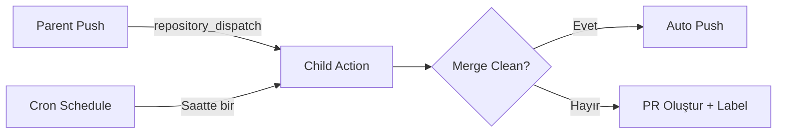

<<<<<<< HEAD
# Child Repository

> Parent repository'nin fork'u — upstream değişiklikleri otomatik olarak sync edilir.

## Nasıl Çalışır?



1. **Otomatik tetiklenme**: Parent repo push yaptığında `repository_dispatch` event'i ile veya saatte bir cron ile
2. **Clean merge**: Upstream değişiklikler conflict olmadan merge edilir → otomatik push
3. **Conflict**: Merge başarısız olursa → ayrı branch'te PR oluşturulur, `auto-sync` ve `conflict` label'ları eklenir

## Kurulum

### 1. Upstream Remote Ekle (Local)

```bash
git remote add upstream https://github.com/OWNER/parent-repo.git
git fetch upstream
```

### 2. Repository Settings

**Settings → Actions → General → Workflow permissions:**
- ✅ Read and write permissions
- ✅ Allow GitHub Actions to create and approve pull requests

### 3. Secrets (Opsiyonel)

| Secret | Açıklama |
|---|---|
| `SLACK_WEBHOOK_URL` | Conflict bildirimi için Slack webhook (opsiyonel) |
=======
# Parent Repository

> **Source of truth** — tüm core kod burada yaşar.

## Nasıl Çalışır?

`main` branch'e push yapıldığında `.github/workflows/notify-children.yml` workflow'u tetiklenir ve tanımlı child repository'lere `repository_dispatch` event'i gönderir.

## Kurulum

### 1. Secret Tanımla

Repository Settings → Secrets → Actions → **New repository secret**:

| Secret | Açıklama |
|---|---|
| `CHILD_REPOS_PAT` | Child repo'lara dispatch gönderebilmek için `repo` scope'lu Personal Access Token |

### 2. Child Repo Listesini Güncelle

`.github/workflows/notify-children.yml` dosyasında `CHILD_REPOS` environment variable'ını düzenle:

```yaml
env:
  CHILD_REPOS: |
    owner/child-repo-1
    owner/child-repo-2
```

### 3. Push ve İzle

```bash
git add .
git commit -m "feat: update core logic"
git push origin main
# → GitHub Actions child repo'lara dispatch gönderecek
```
>>>>>>> upstream/main

## Dosya Yapısı

```
<<<<<<< HEAD
child/
├── .github/
│   └── workflows/
│       └── sync.yml
├── src/
│   └── app.py
├── config/
│   └── settings.json
=======
parent/
├── .github/
│   └── workflows/
│       └── notify-children.yml
├── src/
│   └── core.py
>>>>>>> upstream/main
└── README.md
```
