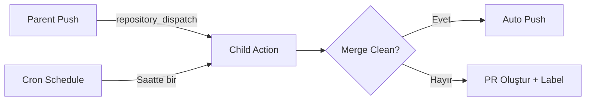

# Child Repository

> Parent repository'nin fork'u — upstream değişiklikleri otomatik olarak sync edilir.

## Nasıl Çalışır?



1. **Otomatik tetiklenme**: Parent repo push yaptığında `repository_dispatch` event'i ile veya saatte bir cron ile
2. **Clean merge**: Upstream değişiklikler conflict olmadan merge edilir → otomatik push
3. **Conflict**: Merge başarısız olursa → ayrı branch'te PR oluşturulur, `auto-sync` ve `conflict` label'ları eklenir

## Kurulum

### 1. Upstream Remote Ekle (Local)

```bash
git remote add upstream https://github.com/OWNER/parent-repo.git
git fetch upstream
```

### 2. Repository Settings

**Settings → Actions → General → Workflow permissions:**
- ✅ Read and write permissions
- ✅ Allow GitHub Actions to create and approve pull requests

### 3. Secrets (Opsiyonel)

| Secret | Açıklama |
|---|---|
| `SLACK_WEBHOOK_URL` | Conflict bildirimi için Slack webhook (opsiyonel) |

## Dosya Yapısı

```
child/
├── .github/
│   └── workflows/
│       └── sync.yml
├── src/
│   └── app.py
├── config/
│   └── settings.json
└── README.md
```
